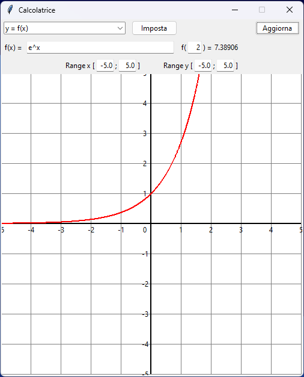

# Calcolatrice Grafica

## Specifiche

Potete trovare le specifiche nella cartella `spec/`.

## Codice

Mettere il codice sorgente in `src/`, non modificare `main.py` eccetto per
quanto richiesto al suo interno. Per il proprio codice sorgente si possono
creare dei nuovi file.

**ATTENZIONE**

È richiesto solo di scrivere funzioni o classi, mai qualcosa che viene
eseguito fine a sé stesso. **Se nel vostro codice qualcosa viene eseguito senza
che ci sia un `if __name__ == "__main__"` avete sbagliato qualcosa.** Il codice
dentro a classi e funzioni non è eseguito se non chiamato esplicitamente
(leggere sotto per capire come usare `if __name__ == "__main__"`).

### Stile

Vedere le [specifiche generali](spec/specifiche_generali.md#stile).

## Problemi non risolti

1. `interpreta_funzione` non accetta numeri con la virgola
2. `interpreta_funzione` considera parole separate da spazi unite
3. mancano `Circonferenza`, `Ellisse`, `IperboleTipo1` e `IperboleTipo2`
4. le righe della tela non si adattano al range selezionato
5. una funzione non viene disegnata se ci sono punti che non sono nel dominio
   (es. `sqrt(x)` non viene disegnata quando c'è una parte negativa nella tela)
6. i numeri nella tela scompaiono quando gli assi escono dalla finestra visibile

## Miglioramenti futuri

- permettere di inserire più funzioni/relazioni
- permettere di cambiare lo stile delle funzioni (colore, spessore, visibilità)
- rendere l'interfaccia dinamica (rimuovere "Aggiorna" e aggiornare quando cambiano i dati)
- utilizzare il mouse per muovere e fare lo zoom sulla tela
- il disegna funzioni adatta la densità dei punti alla pendenza della funzione
